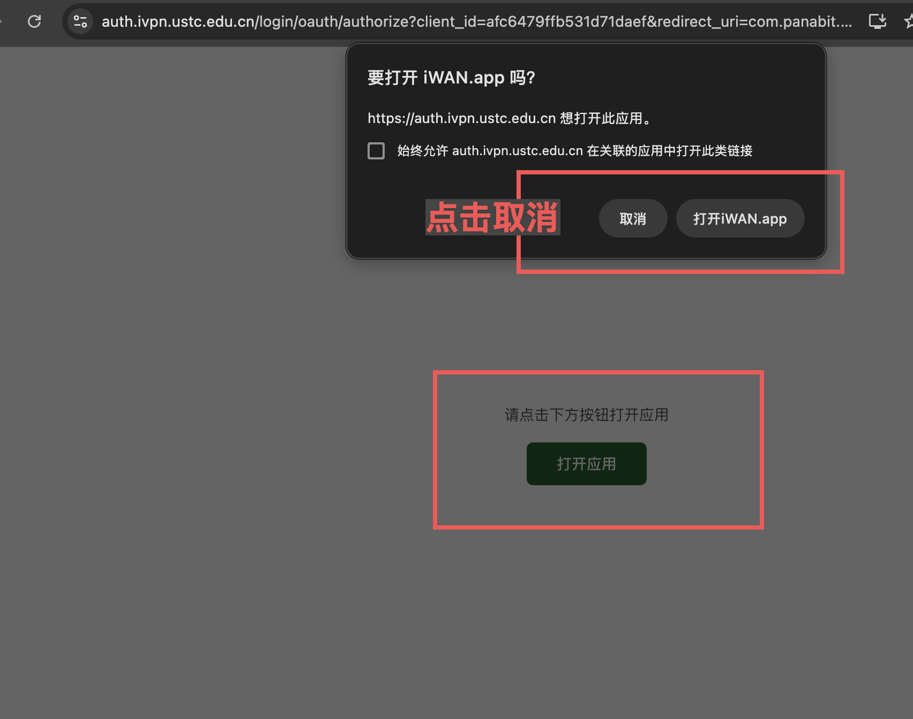

# ustc-iwan

USTC iWAN 的 Linux 命令行客户端，用于通过统一身份认证获取线路配置，并按需建立 TUN 隧道。

主要功能：

- 通过 OIDC 登录获取 iWAN 线路配置。
- 将线路配置保存到本机，后续可直接离线查看线路列表。
- 选择线路建立 Linux TUN 隧道。
- 按 IP、域名或 CIDR 精确控制哪些流量进入隧道。

仓库包含三个二进制：

| 二进制 | 用途 |
|--------|------|
| `iwan-client-oidc` | 推荐使用。负责登录、保存线路配置、选择线路并连接。 |
| `iwan-client` | 手动指定服务器、用户名和密码，适合调试或自定义接入。 |
| `iwan-server` | 自建兼容测试服务端，普通用户通常不需要。 |

## 系统要求

- Linux。
- 系统需要 `/dev/net/tun`。
- 连接时需要 root 权限，或为程序授予 `CAP_NET_ADMIN`。

## 下载

从 GitHub Releases 下载对应架构的二进制。

常用文件：

- `iwan-client-oidc-aarch64-musl`
- `iwan-client-oidc-x86_64-musl`
- `iwan-client-aarch64-musl`
- `iwan-client-x86_64-musl`

下载后加执行权限：

```bash
chmod +x iwan-client-oidc-*
```

源码构建产物位于：

```text
target/<target>/release/
```

## OIDC 使用流程

### 1. 获取线路配置

```bash
./iwan-client-oidc --fetch
```

命令会输出登录链接。用浏览器打开链接并完成认证后，将回调 URL 粘贴回终端。

如果浏览器提示打开 `iWAN.app`，选择取消，保留在当前网页：



随后在页面按钮上复制链接地址，将复制到的 `com.panabit.mobile://...` 回调 URL 粘贴回终端：


配置保存位置：

```text
~/.config/iwan/servers.json
```

配置文件包含线路地址、用户名和加密后的线路密码。`--list` 只读取线路信息，不解密密码。

### 2. 列出本地线路

```bash
./iwan-client-oidc --list
```

示例输出：

```text
 1. 教育网线路                          <server-ip>:6001
 2. 电信线路                           <server-ip>:6002
 3. 联通线路                           <server-ip>:6001
 4. 移动线路                           <server-ip>:6001
```

如果配置文件不存在，命令会提示先执行 `--fetch`。

### 3. 连接

```bash
sudo ./iwan-client-oidc --connect
```

命令会读取本地配置并显示线路列表。输入序号后，只解密所选线路的密码，并建立 TUN 隧道。

配置用普通用户执行 `--fetch` 保存即可。连接时即使使用 `sudo`，也不需要把配置文件复制到 root 用户目录。

### 4. 一次完成

```bash
sudo ./iwan-client-oidc --all
```

该命令依次完成：

```text
--fetch -> --list -> --connect
```

## 路由规则

默认连接只创建并配置 `iwan0`，不会修改业务流量路由。

需要让指定目标走 iWAN 时，显式传入代理规则：

```bash
sudo ./iwan-client-oidc --connect \
  --proxy-ip 1.1.1.1,2.2.2.2 \
  --proxy-domain example.com,api.example.com \
  --proxy-cidr 10.0.0.0/8
```

参数说明：

| 参数 | 说明 |
|------|------|
| `--proxy-ip` | 指定 IPv4 地址，自动转换为 `/32` 路由。 |
| `--proxy-domain` | 连接前解析域名，并把解析得到的 IPv4 地址加入路由。 |
| `--proxy-cidr` | 指定 CIDR 网段，例如 `10.0.0.0/8` 或 `0.0.0.0/0`。 |
| `--tun` | TUN 设备名，默认 `iwan0`。 |
| `--encrypt` | 协议加密模式，默认 `1`。 |

代理参数可以重复，也可以用逗号分隔：

```bash
--proxy-ip 1.1.1.1,2.2.2.2
--proxy-ip 1.1.1.1 --proxy-ip 2.2.2.2
```

将全部流量路由到 iWAN：

```bash
sudo ./iwan-client-oidc --connect --proxy-cidr 0.0.0.0/0
```

注意：域名只在连接时解析一次。连接后域名解析变化不会自动同步到路由表。

## OIDC 命令参数

| 参数 | 行为 |
|------|------|
| `--fetch` | 通过 OIDC 登录并保存线路配置。 |
| `--list` | 读取本地配置并列出线路，不联网，不解密密码。 |
| `--connect` | 只读取本地配置，选择线路并连接。 |
| `--all` | 拉配置、列线路、选择并连接。 |
| `--config-dir <DIR>` | 指定配置目录，默认 `~/.config/iwan`。 |

必须指定 `--fetch`、`--list`、`--connect`、`--all` 中的至少一个动作。

## Docker 代理模式

用于把 `iwan-client-oidc` 封装成宿主机可用的本地代理镜像，暴露给宿主机的代理端口为：

- SOCKS5：`127.0.0.1:1080`
- HTTP：`127.0.0.1:8888`

容器内会先建立 iWAN TUN 隧道，再启动 [3proxy](https://github.com/3proxy/3proxy)。宿主机本地代理端口后，代理进程的出站流量会走容器内的 iWAN 隧道。

构建镜像：

```bash
docker build -f Dockerfile -t ustc-iwan-client-oidc .
# 或 docker compose build
```

启动代理：

```bash
docker run -it \
  --name ustc-iwan \
  --restart unless-stopped \
  --cap-add NET_ADMIN \
  --device /dev/net/tun \
  --sysctl net.ipv6.conf.all.disable_ipv6=1 \
  --sysctl net.ipv6.conf.default.disable_ipv6=1 \
  --sysctl net.ipv6.conf.lo.disable_ipv6=1 \
  -p 127.0.0.1:1080:1080 \
  -p 127.0.0.1:8888:8888 \
  -v "$PWD/data/iwan:/config" \
  ustc-iwan-client-oidc
```

如果 `/config/servers.json` 不存在，容器会先输出 OIDC 登录链接。按前文流程在同一交互式命令行完成浏览器认证后，把回调 URL 粘贴回终端。随后容器会列出线路，选择一次后会保存该线路编号。配置会保存到宿主机的：

```text
./data/iwan/servers.json
```

线路选择会保存到：

```text
./data/iwan/server_index
```

后续启动或重启会直接复用已保存的登录配置和线路选择：

```bash
docker start ustc-iwan
docker restart ustc-iwan
```

测试宿主机访问测试：

```bash
curl --proxy socks5h://127.0.0.1:1080 https://api.llm.ustc.edu.cn
curl --proxy http://127.0.0.1:8888 https://api.llm.ustc.edu.cn
```

排查日志：

```bash
docker logs ustc-iwan
```

默认禁用 IPv6，避免 TUN 刚启动时产生 IPv6 链路本地流量影响 iWAN 数据面。端口只绑定到 `127.0.0.1`，不会暴露到局域网。

## 手动客户端

`iwan-client` 不使用 OIDC，需要手动提供服务器、用户名和密码。

```bash
./iwan-client ping --server <SERVER_IP> --port 6001
```

仅测试认证：

```bash
./iwan-client auth \
  --server <SERVER_IP> \
  --port 6001 \
  --user <USER> \
  --pass '<PASSWORD>'
```

建立隧道：

```bash
sudo ./iwan-client proxy \
  --server <SERVER_IP> \
  --port 6001 \
  --user <USER> \
  --pass '<PASSWORD>' \
  --proxy-ip 1.1.1.1,2.2.2.2
```

## 从源码构建

本地构建：

```bash
cargo build --release --bin iwan-client-oidc
cargo build --release --bin iwan-client
cargo build --release --bin iwan-server
```

交叉编译到 aarch64 Linux musl：

```bash
cargo install cargo-zigbuild
rustup target add aarch64-unknown-linux-musl
cargo zigbuild --bin iwan-client-oidc --target aarch64-unknown-linux-musl --release
```

GNU 目标可以指定 glibc 版本：

```bash
cargo zigbuild --bin iwan-client --target x86_64-unknown-linux-gnu.2.17 --release
cargo zigbuild --bin iwan-client --target aarch64-unknown-linux-gnu.2.17 --release
```

## 服务端

`iwan-server` 用于自建测试环境。连接 USTC iWAN 不需要运行服务端。

```bash
sudo ./iwan-server \
  --port 6001 \
  --tun iwan-srv \
  --server-ip 198.18.0.1 \
  --subnet 198.18.0.0/16 \
  --dns 114.114.114.114 \
  --users /etc/iwan/users.txt \
  --nat-if eth0
```

用户文件格式：

```text
username:password
```

服务端所在机器需要开启 IPv4 转发和 NAT：

```bash
echo 1 | sudo tee /proc/sys/net/ipv4/ip_forward
sudo iptables -t nat -A POSTROUTING -s 198.18.0.0/16 -o eth0 -j MASQUERADE
```

## 免责声明

本项目仅供学习、研究和合法授权访问使用。使用者应自行确认其使用方式符合所在网络和服务的规则。
